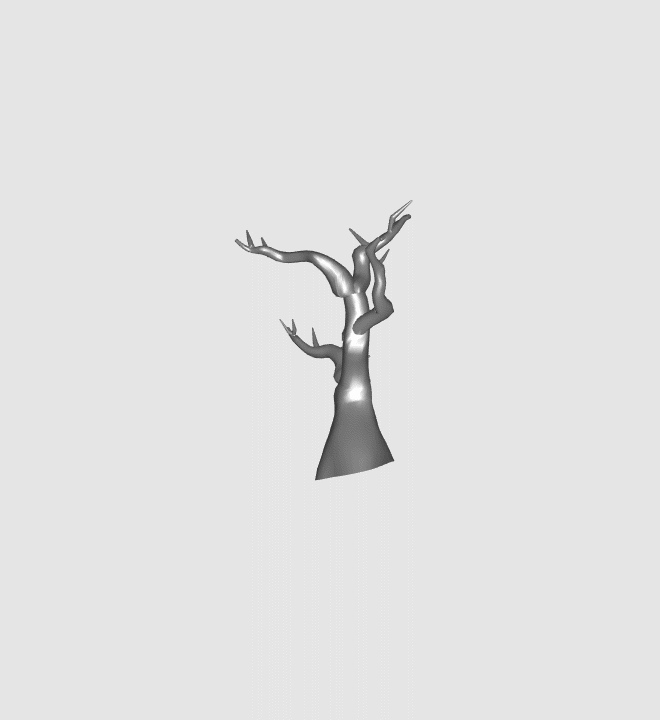

This is the implementation for the paper **TreeSRNF: Square-Root Normal Fields for Generative Modelling of the Geometric and Structural Variability in Tree-like 3D Objects.**

Detailed results can be found on our [project website](https://tahmina979.github.io/Tree_in_SRNF/)

**Step-by-step-guide:**

The input example data of 3D trees models are provided in **NeoroData** folder.

**Step 1: Registration**

Run **registration.m** to perform registration in a set of 3D tree-shapes.

**Step 2: Geodesic computation**

Run **Geodesic_computation_before_reg.m** to visualize the geodesic path between two 3D tree models before performing registration.

Run **Geodesic_computation_after_reg.m** to visualize the geodesic path between two 3D tree models after performing registration.

**Step 3: Summary statistics**

Run **Mean_modes.m** to visualize the mean 3D shape and the variation of a registered set in the first principal direction of variation. If you want to explore in other principal directions, the instruction is given in the script.

**Mean shape of set4**

**Mode in first principal direction of set4**

**Step 4: Random sample synthesis**

Run **Synthesize.m** to get random samples by learning from a set.

**Synthesized 3D tree**

If this repository is useful for your research and you use it, please cite.

<section class="section" id="BibTeX">
  

    <h2 class="title">BibTeX</h2>
    <pre><code>@article{,
  author    = {Tahmina Khanam, Hamid Laga, Mohammed Bennamoun, Guanjin Wang, Ferdous Sohel, Farid Boussaid, and Anuj Srivastava},
  title     = {TreeSRNF: Square-Root Normal Fields for Generative Modelling of the Geometric and Structural Variability in Tree-like 3D Objects.},
  journal   = {},
  year      = {},
}</code></pre>
  

</section>
